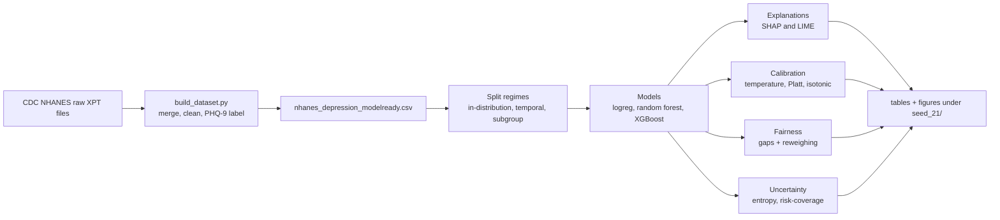
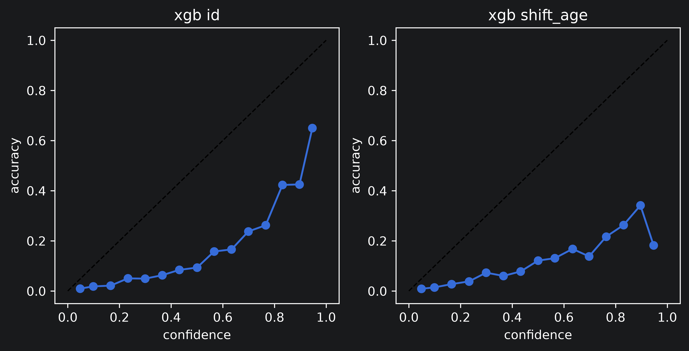
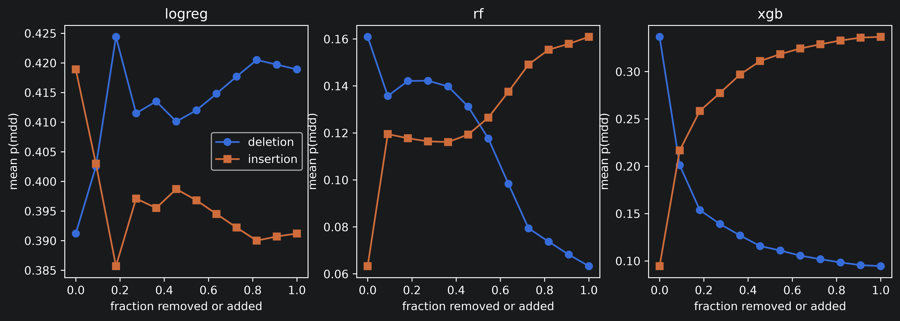
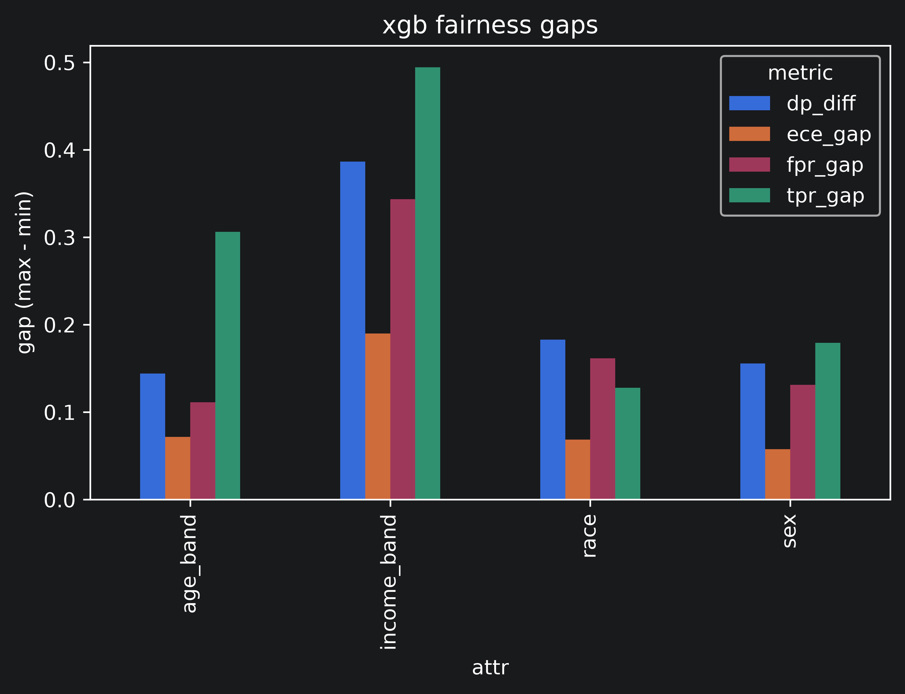
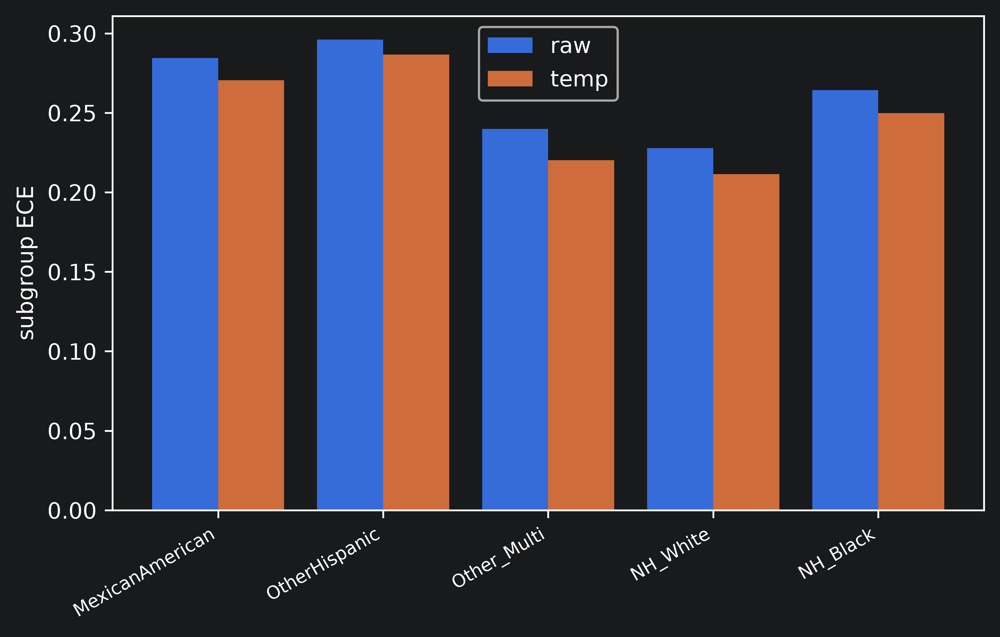
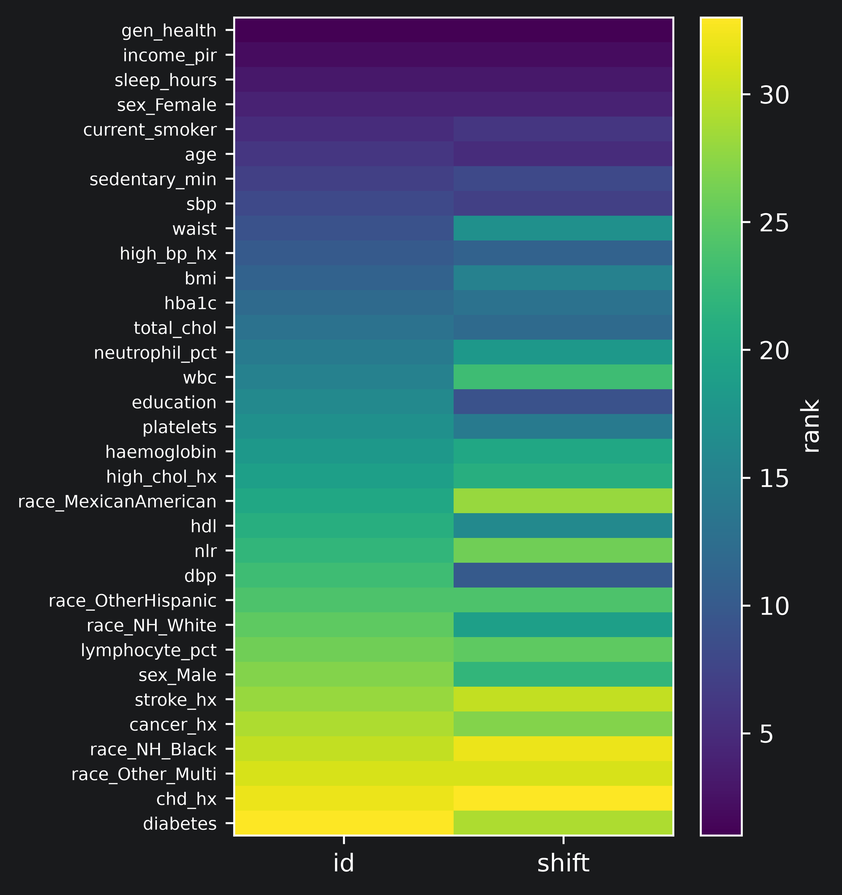
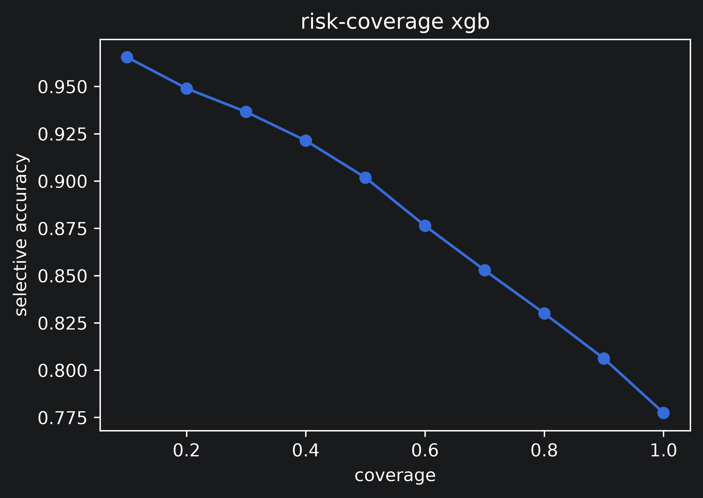

# Responsible-AI Audit of a Depression-Risk Model

[](LICENSE)
[](#)
[](https://www.python.org/)
[](https://scikit-learn.org/)
[](https://xgboost.readthedocs.io/)
[](https://github.com/shap/shap)
[](https://github.com/marcotcr/lime)
[-006699.svg)](https://wwwn.cdc.gov/nchs/nhanes/)

This repository holds the data-building pipeline, the audit notebook, and the full per-seed results and figures for a study that does not try to build the best depression-risk model. It builds ordinary risk models on public tabular health data and then audits the responsible-AI tools applied to them: the explanations (SHAP and LIME), the fairness metrics and a debiasing step, the calibration and its post-hoc repair, and the predictive uncertainty. The question is whether those tools are reliable, agree with each other, and hold up across populations, or whether they quietly disagree and fail.

**Author:** Hrushikesh Sanap (independent researcher), India. [ORCID 0009-0004-1927-6493](https://orcid.org/0009-0004-1927-6493)

**Status:** ongoing research. The results below are a single-seed audit (seed 21) released for transparency while the work continues. Multi-seed aggregation, which is what would let stability and variance be reported, is planned and not yet included. Nothing here has been peer-reviewed.

> This is research code. It uses a public survey and standard estimators, and it is not a deployable or clinical tool. The label is a PHQ-9 screening proxy for major depressive disorder, not a clinical diagnosis, and the point of the project is to show where the surrounding audit tools are unreliable, not to certify a model as safe. Nothing here should be used to make decisions about any individual.

## Overview

The design has one intent: hold the modelling ordinary and turn the scrutiny onto the tools that are supposed to make a model trustworthy.

- **One built dataset.** `build_dataset.py` downloads the raw NHANES public files from the CDC, merges the components on the respondent identifier across seven survey cycles, controls label leakage by construction, and writes a single model-ready CSV. The build is reproducible from source, not a pre-cleaned download.
- **Three models spanning transparency and family.** Logistic regression (a transparent anchor), random forest, and XGBoost, each class-weighted to counter the 8.7% positive rate.
- **Three split regimes.** In-distribution, a temporal cohort shift (train on 2005 to 2014, test on 2015 to 2018), and a subgroup shift (train on ages 18 to 49, test on 65 and over).
- **Four audit axes.** Explanation reliability (SHAP against LIME, faithfulness, stability), calibration and its post-hoc repair (temperature, Platt, isotonic), fairness across four protected attributes with a reweighing interaction test, and predictive uncertainty with a risk-coverage curve.
- **One knob.** The notebook runs end to end from a single `SEED` variable and saves every model, table, and figure under `seed_<SEED>/`.



## Data

The dataset is the National Health and Nutrition Examination Survey (NHANES), a public survey run by the CDC's National Center for Health Statistics. No ethics approval or registration is required to use the public files. `build_dataset.py` pulls seven cycles and joins the demographic, examination, laboratory, and questionnaire components on the respondent identifier `SEQN`.

The target is a screening proxy for major depressive disorder: the PHQ-9 total (the sum of the nine `DPQ` items), thresholded at 10, the standard cut for likely MDD. A second cut at 15 is carried for sensitivity. The refused and don't-know codes are mapped to missing before scoring, and any respondent without a complete, scorable PHQ-9 is dropped.

**Leakage is controlled by construction.** The nine PHQ items, the functional-impairment item, and antidepressant medications are never used as features; the PHQ items build the label and are then excluded, and an assertion halts the build if any survive into the feature matrix. Features missing in more than 40% of rows are dropped automatically, which removes the fasting-subsample labs. The age and income bands are held aside as protected attributes only, since the continuous age and income already carry that signal to the model.

| Property | Value |
| --- | --- |
| Source | NHANES public files, CDC / NCHS |
| Cycles | 2005-2006 through 2017-2018 (seven) |
| Respondents (adults, scorable PHQ-9) | 36,259 |
| Positive rate (PHQ-9 >= 10) | 8.74% |
| Model features | 28 (26 numeric, 2 categorical) |
| Protected attributes | sex, race, age band, income band |

The built CSV can be uploaded to Kaggle as a standalone dataset; the raw XPT files are cached under `files/data/raw/` and are not required once the CSV exists.

## Method

**Models.** Logistic regression, random forest, and XGBoost, each with balanced class weighting. The imputer, scaler, and one-hot encoder are fit on the training split only, per regime.

**Explanations (SHAP and LIME).** For each model, TreeSHAP (trees) or LinearSHAP (logistic regression) global importances are compared against tabular LIME importances on a fixed evaluation set. The audit reports their rank agreement (Spearman, Kendall, top-10 overlap), deletion and insertion faithfulness curves, and a perturbation-stability index. Explanation drift is measured by re-ranking SHAP importance under each shift.

**Calibration.** Expected and maximum calibration error, Brier score, and negative log-likelihood, with reliability diagrams, before and after temperature, Platt, and isotonic calibration fitted on a held-out validation slice.

**Fairness.** Per-group selection rate, true and false positive rates, precision, and subgroup calibration error, across sex, race, age band, and income band. A reweighing pre-processing step tests whether fixing one fairness notion disturbs calibration and the explanations.

**Uncertainty.** Predictive entropy and a risk-coverage curve for selective prediction.

## Key findings

All numbers are from seed 21, in the in-distribution regime unless a shift is named.

- **The fairness gap is the headline, and income is the dominant axis.** For XGBoost the lowest-income group is flagged at 46% against 7.5% for the highest, a demographic-parity gap of 0.39 and a true-positive-rate gap of 0.49, with worse calibration for the disadvantaged group (subgroup ECE 0.35 against 0.16). The base-rate difference explains only a fraction of this.
- **SHAP and LIME disagree on roughly half of each model's top ten features.** Both rank self-rated general health first, but the top-10 overlap is 0.54 for all three models and rank correlation is only moderate. The choice of explanation method changes which mid-tier risk factors would be reported.
- **Temperature scaling is the wrong calibrator here; Platt and isotonic repair it.** A single scalar barely moves the error (XGBoost ECE 0.25 to 0.24), because the miscalibration comes from class weighting, a shift and scale a one-parameter fix cannot undo, while Platt and isotonic drive it to about 0.006.
- **Each fairness or calibration fix addresses only its own criterion.** Reweighing cut the demographic-parity gap by 69% but left the true-positive-rate gap, the overall calibration, and the SHAP top-10 unchanged. A single global temperature lowers every subgroup's calibration error by a similar amount without closing the gap between groups.
- **Post-hoc calibration holds under this data's shift; there is no collapse.** The NHANES cohort shift is mild, base rates barely move, and Platt-calibrated error stays low under both the temporal and the age shift. This is stated as a scoping result, not a robustness failure.
- **Uncertainty is usable for triage.** Selective accuracy rises from 0.78 at full coverage to 0.97 at the most confident tenth, and errors carry higher entropy than correct predictions.

## Results

### Discrimination and calibration (in-distribution, seed 21)

The three models discriminate almost identically. Raw calibration is poor for logistic regression and XGBoost and repaired by Platt or isotonic scaling. Accuracy is not a headline metric here: under an 8.7% base rate a well-calibrated model scores about 0.91 by predicting the majority class, so PR-AUC and calibration carry the signal.

| Model | ROC-AUC | PR-AUC | ECE (raw) | ECE (Platt) |
| --- | --- | --- | --- | --- |
| Logistic regression | 0.786 | 0.314 | 0.305 | 0.008 |
| Random forest | 0.789 | 0.282 | 0.076 | 0.009 |
| XGBoost | 0.790 | 0.306 | 0.253 | 0.006 |

No-skill PR-AUC equals the base rate, 0.087, so 0.30 is roughly three and a half times chance.

The reliability diagram makes the raw overconfidence visible: the points sit well below the diagonal, and the age-shifted panel keeps the same shape with a noisier tail.



### Explanations: SHAP against LIME (in-distribution, seed 21)

The two explanation methods agree on the top feature but diverge below it. Random forest shows the weakest agreement. Faithfulness (lower deletion is better, higher insertion is better) is cleaner for the tree models than for logistic regression.

| Model | Spearman | Kendall | Top-10 Jaccard | Deletion AUC | Insertion AUC | Stability |
| --- | --- | --- | --- | --- | --- | --- |
| Logistic regression | 0.821 | 0.701 | 0.538 | 0.414 | 0.395 | 0.956 |
| Random forest | 0.532 | 0.371 | 0.538 | 0.113 | 0.130 | 0.968 |
| XGBoost | 0.612 | 0.455 | 0.538 | 0.133 | 0.292 | 0.875 |

The faithfulness curves show the deletion and insertion paths separating cleanly for the tree models, the signature of a faithful ordering, and staying closer together for logistic regression.



### Fairness (XGBoost, in-distribution, seed 21)

Whatever fairness metric is chosen, income is where the model is most unfair.

| Attribute | Parity gap | TPR gap | FPR gap | Subgroup ECE gap |
| --- | --- | --- | --- | --- |
| Sex | 0.156 | 0.179 | 0.131 | 0.058 |
| Race | 0.183 | 0.128 | 0.162 | 0.068 |
| Age band | 0.144 | 0.306 | 0.111 | 0.072 |
| Income band | 0.386 | 0.494 | 0.343 | 0.190 |



The income breakdown shows the pattern directly: the low-income group is over-flagged well beyond its higher prevalence, at a high false-positive rate, and with the noisiest probabilities.

| Income group | n | Base rate | Selection | TPR | FPR | Subgroup ECE |
| --- | --- | --- | --- | --- | --- | --- |
| Low | 2,108 | 0.134 | 0.462 | 0.794 | 0.410 | 0.354 |
| Mid | 2,574 | 0.082 | 0.203 | 0.583 | 0.169 | 0.240 |
| High | 1,941 | 0.036 | 0.075 | 0.300 | 0.067 | 0.164 |

One caveat worth stating: random forest shows near-zero gaps, but it earns that by predicting almost no positives. The two models that act on their signal carry the large gaps despite discriminating no better, so fairness and willingness to predict are coupled.

### Interaction: does a debiasing step disturb the other tools?

Reweighing on race (logistic regression) equalises who gets flagged but does nothing for who gets correctly flagged, nothing for overall calibration, and does not rewrite the explanation.

| State | TPR gap | Parity gap | Overall ECE | SHAP top-10 Jaccard |
| --- | --- | --- | --- | --- |
| Before | 0.167 | 0.265 | 0.305 | reference |
| After | 0.168 | 0.082 | 0.306 | 1.00 |

A single global temperature lowers every race group's calibration error by a similar amount while leaving the ordering and the gaps between groups intact.



### Explanation drift and uncertainty

Under temporal shift the feature-importance ordering barely moves (Spearman 0.90), which the heatmap shows as two near-identical columns. Under age shift the aggregate correlation stays high (0.86) but hides real movement: sedentary time falls fourteen ranks, blood pressure and age rise. The lesson is to report per-feature rank change, not only the aggregate.



Predictive uncertainty is usable: deferring the least confident cases raises accuracy sharply, from 0.78 at full coverage to 0.97 at the most confident tenth.



The complete per-seed tables (performance, per-model SHAP-versus-LIME agreement, faithfulness curves, drift, fairness gaps, subgroup calibration, risk-coverage) are under `files/seed_21/results/`, with a single consolidated `summary_seed_21.json`.

## Repository structure

```
responsible_ai_audit_depression_risk/
├── files/
│   ├── build_dataset.py                     # NHANES download, merge, clean, PHQ-9 label -> CSV
│   ├── audit_depression_risk_mode.ipynb     # single-seed audit notebook
│   ├── data/
│   │   ├── raw/                             # cached CDC XPT files, one folder per cycle
│   │   ├── nhanes_depression_modelready.csv
│   │   └── nhanes_depression_full.csv
│   └── seed_21/
│       ├── models/                          # 9 fitted models (3 regimes x 3 models)
│       ├── figures/                         # 6 plots, PNG (600 dpi) + SVG
│       └── results/                         # 14 result tables + summary_seed_21.json
├── .gitignore
├── LICENSE                                  # MIT
├── requirements.txt
└── README.md
```

## Reproducibility

The pipeline was run on Python 3.11. Because the conda build of LIME is pinned to older Python, a fresh environment installed through pip is the reliable route.

```bash
conda create -n xai python=3.11 -y
conda activate xai
pip install -r requirements.txt
```

**Build the dataset.** From `files/`, run the pipeline. It downloads and caches the raw files on the first run, then writes the CSV.

```bash
cd files
python build_dataset.py
```

**Run the audit.** Start Jupyter from `files/` so the `../data/...` path resolves, open `audit_depression_risk_mode.ipynb`, set `SEED` in the seed cell, and run all. Outputs land under `files/seed_<SEED>/`. The notebook prints every result as a text table in the cell outputs and renders every figure inline as well as saving PNG (600 dpi) and SVG copies.

## Ongoing work

- Aggregate across seeds 21 to 30 to report mean, standard deviation, and bootstrap intervals, and to characterise cross-seed explanation stability, which a single seed cannot.
- Run the temperature-versus-subgroup-calibration test on income, where the gap it fails to close is largest.
- Add a tabular neural network to widen the model-family comparison.

## Data source

National Health and Nutrition Examination Survey (NHANES), National Center for Health Statistics, Centers for Disease Control and Prevention. Public-use data files. https://wwwn.cdc.gov/nchs/nhanes/

The target uses the PHQ-9 depression screening instrument as distributed in the NHANES `DPQ` questionnaire component. The PHQ-9 is a screening tool, not a diagnostic instrument.

## License

Released under the MIT License; see [LICENSE](LICENSE). The MIT terms cover the code in this repository. The NHANES data are public-domain U.S. government survey files, governed by the CDC's data-use terms, and are not redistributed here beyond the derived, de-identified tabular CSV.
